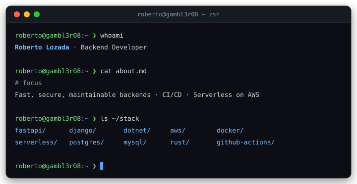

  

  

  
  
  
  

 

  

 

## Stack

  
  
  
  
  
    
  
  
  
  
  
  

## GitHub Analytics

  
    
  
  
    
  

## Contributions

  <picture>
    <source media="(prefers-color-scheme: dark)" srcset="https://raw.githubusercontent.com/Gambl3r08/Gambl3r08/output/snake-dark.svg">
    
  </picture>

 

  

